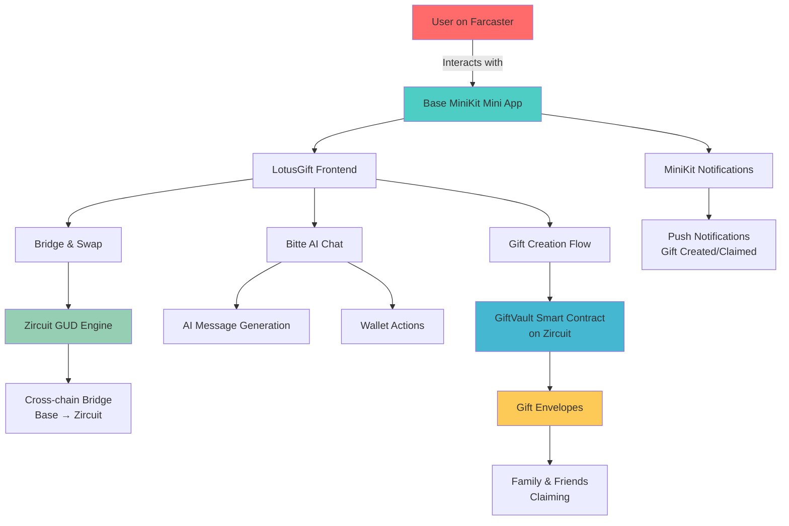

# LotusGift

**Send meaningful gifts onchain with the warmth of a red envelope.** LotusGift transforms digital gifting by combining heartfelt messages with programmable money, making cross-chain value transfer as simple as sending a text message.

## Vision

**Make onchain gifting feel like giving a handwritten card with cash inside - personal, instant, and joyful.** **Bridge the gap between human connection and digital finance through AI-assisted messaging, cross-chain liquidity, and delightful user experiences.**

## The Value

**For Gift Senders:**
- Create beautiful, message-attached gifts that recipients actually want to claim
- Send value across any blockchain without thinking about gas fees or technical complexity  
- Get AI help crafting the perfect message for any occasion
- Track gift delivery and claiming in real-time

**For Recipients:**
- Receive gifts as beautiful red envelopes with personal messages
- Claim instantly through familiar social apps (Farcaster integration)
- No need to understand wallets or blockchains - it just works
- Keep the sentimental value alongside the financial value

**For the Ecosystem:**
- Drives organic adoption of onchain finance through gifting use cases
- Creates positive-sum interactions that bring families and friends onchain together
- Demonstrates how AI agents can make crypto more human and accessible

## Architecture



## How It Works

- **Connect**: Users discover LotusGift through Farcaster and connect via Base MiniKit
- **Create**: Choose an amount, write a message (or let AI help), and create a gift envelope
- **Bridge**: Automatically swap and bridge funds from Base to Zircuit using GUD Engine
- **Deploy**: Smart contract creates a claimable envelope on Zircuit with your message
- **Notify**: Recipients get beautiful notifications through MiniKit about their gift
- **Claim**: Family and friends claim their envelopes with one tap — no crypto knowledge needed
- **Celebrate**: Both parties see the gift claimed and can share the moment

## Why This Matters

Traditional crypto transfers feel cold and transactional. LotusGift brings back the joy of gifting by:

- **Making it personal**: Every gift includes a heartfelt message
- **Making it simple**: Recipients don't need to understand blockchain technology
- **Making it social**: Integrated with platforms people already use (Farcaster)
- **Making it smart**: AI helps craft perfect messages and handles complex bridging
- **Making it beautiful**: Red envelope aesthetics create emotional connection

## Getting Started

### For Users
- Open the LotusGift mini app through Farcaster
- Connect your wallet via Base MiniKit
- Create your first gift envelope
- Share with family and friends
- Watch the magic happen ✨

### For Developers

```bash
# Frontend
cd frontend
pnpm install
pnpm dev

# Backend AI Agent  
pnpm install
npx tsx backend/server.ts

# Smart Contracts
cd frontend/contracts
forge build && forge test
```

## Environment Setup

```bash
# Essential configs
NEXT_PUBLIC_ONCHAINKIT_API_KEY=your_key
NEXT_PUBLIC_WALLETCONNECT_PROJECT_ID=your_project_id
BITTE_API_KEY=your_bitte_key
ZIRCUIT_ENGINE_API_KEY=your_engine_key
```

## Repository Structure

```
├── frontend/          # Next.js app with MiniKit integration
│   ├── app/           # Pages (gift creation, AI chat, home)
│   ├── contracts/     # GiftVault smart contract (Solidity)
│   └── src/           # Components, libs, providers
├── backend/           # Bitte AI agent server (Hono)
└── scripts/           # Deployment and utility scripts
```

## License

MIT - Built with ❤️ for the onchain community
